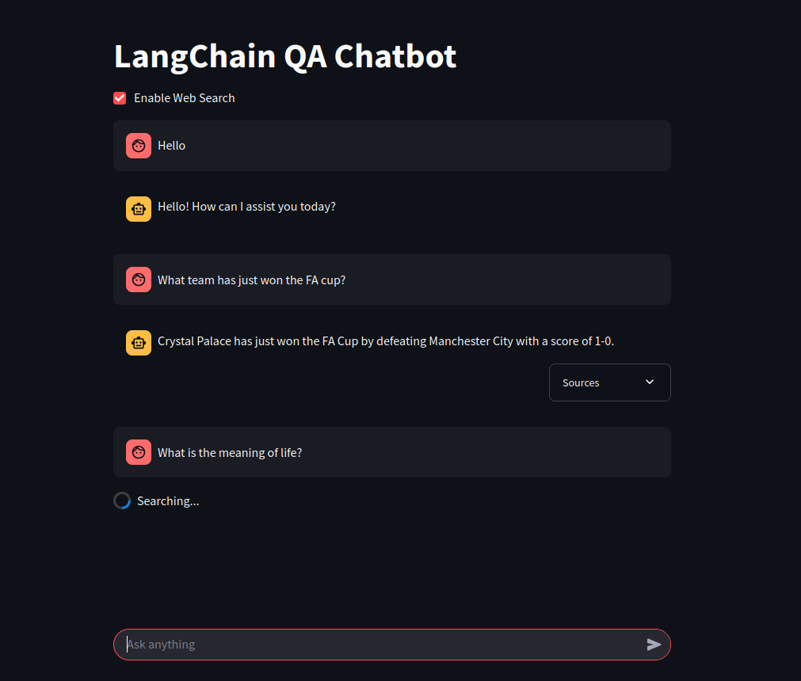

# Web-Enabled LangChain Chatbot with Citations

This project is a Streamlit application that uses a **large language model (LLM)** with web search to answer user questions, providing cited sources for its responses. It integrates OpenAI's GPT model with the Tavily search API to retrieve up-to-date information from the web, then generates an answer that includes references to the sources of information. By default, the LLM is configured with a low temperature (~0.2) to produce focused and deterministic answers. Lower temperatures favor accuracy and coherence, whereas higher temperatures can yield more creative but potentially **nonsensical or hallucinatory**. Keeping the temperature low helps ensure the chatbot's answers remain factual and relevant.

**Key Features:**

- **Live Web Search:** Uses Tavily's search API to find relevant content for answering queries (allows answers beyond the LLM's training data).
- **OpenAI GPT-3.5-turbo:** Generates answers based on the search snippets, ensuring coherent and context-aware responses.
- **Citations:** Each answer includes references like "[Source 1]" that correspond to a list of source links, so users can verify the information.
- **Streamlit UI:** Provides an easy-to-use web interface where users can input questions and view answers with expandable source list.

## Setup

**Prerequisites:** Make sure you have **Python 3.10+** installed on your system. You'll also need API keys for OpenAI and Tavily (see below).

1. **Clone the repository:** Download or clone this project to your local machine.
2. **Create a virtual environment:**  
    ```bash
    python3 -m venv .venv
    source .venv/bin/activate   # On Windows: .venv\Scripts\activate
    ```
3. **Install dependencies:** Install the required packages using pip:  
    ```bash
    pip install -r requirements.txt
    ```  
4. **Configure API keys:** The app requires two API keys:  
    - **OpenAI API Key:** Sign up on [OpenAI](https://platform.openai.com/)'s website and copy your API key from the user dashboard.  
    - **Tavily API Key:** Sign up at [Tavily](https://tavily.com) to get an API key (free tier available for a limited number of queries).  
      
    You can provide these keys to the app in one of two ways:  
    - *Use a .env file (recommended):* Create a file named `.env` in the project directory with the contents:
      ```bash
      OPENAI_API_KEY=<your-openai-api-key>
      TAVILY_API_KEY=<your-tavily-api-key>
      ```  
      The app will load this file at startup to get your credentials. The `.env.template` file can be use as a starting point.
    - *Set environment variables:* Alternatively, export `OPENAI_API_KEY` and `TAVILY_API_KEY` in your terminal environment. For example (Linux/Mac):  
      ```bash
      export OPENAI_API_KEY=<your-openai-api-key>
      export TAVILY_API_KEY=<your-tavily-api-key>
      ```  
      On Windows, use `set` instead of `export`.  
    - *Streamlit Cloud:* If deploying on Streamlit's cloud service, add these keys to your app's Secrets (via the cloud UI or a `secrets.toml` file). The app will automatically use `st.secrets` values if present.
5. **Run the app:** Use the Streamlit CLI to launch the app:  
    ```bash
    streamlit run app.py
    ```  
    After a moment, the app will open in your web browser. You can now start asking questions!

## Usage

1. **Open the Streamlit app:** If it hasn’t opened automatically, visit http://localhost:8501 in your web browser.
2. **Ask a question:** You will see a text input field in the app. Enter any question (e.g., "What is the capital of Brazil?" or "What is the Pokemon number 54?") and press **Enter**.
3. **View the answer:** The chatbot will display an answer below the input, along with a expandable "Sources" section. Click the **"Sources"** expander to see the list of references as clickable links.
4. **Iterate:** You can ask another question by typing a new query. Each query/response is independent in this simple version of the app.



*_(Screenshot: example of the app interface showing questions, answers, and cited sources)_*

## Testing

This project includes basic unit tests for the chatbot logic, by validating environment variable checks and ensuring response parsing behave as expected.

To run the tests:
```bash
pip install pytest
pytest
```
The tests are located in test_chatbot.py

## Next Steps

Here are a few ideas for enhancements and next steps in this project:

- **Enhanced UI/UX:** There are many ways to make the interface more user-friendly.
  - Move the “Enable Web Search” checkbox closer to the input field to improve UX — Streamlit currently makes this non-trivial.
  - Add conversation memory so the chatbot can handle follow-up questions in context.
  - Include a clear button to reset the dialogue, or provide options to adjust the LLM's behavior (like temperature or switching between GPT-3.5 and GPT-4).
  - Improve the visual appeal and add functionalities like file uploads for context using Streamlit components or styling.
- **Improved Citation Parsing:** The current approach extracts sources using a simple regex pattern. In the future, we could improve the reliability of citation extraction. For instance, we might prompt the LLM to return answers in a structured JSON format (with separate fields for answer and sources), or implement more robust text parsing to handle edge cases.
- **Expand Unit Tests:** Add tests for additional edge cases and improve test coverage, particularly around error handling, API failures, and malformed responses.
- **Retrieval-Augmented Generation (RAG):** Even for general-purpose Q&A, RAG can be useful for injecting knowledge from your own curated documents, such as manuals or custom datasets. This could supplement or replace live web search for trusted, local information sources.

## Project Structure

This repository is flat (no subdirectories) for simplicity. Each file serves a focused purpose:

- `app.py`: Streamlit-based UI that handles user input, displays chat history, invokes the chatbot, and shows sources in an expandable layout.
- `chatbot.py`: Core chatbot logic, including prompt formatting, OpenAI and Tavily integrations, response parsing, and retry handling.
- `test_chatbot.py`: Basic unit tests (using pytest) for chatbot behavior such as API key validation and response parsing.
- `requirements.txt`: Dependency list for the project.
- `.env.template`: Template environment file showing required environment variables.
- `README.md`: Project documentation, setup instructions, usage examples, and future development suggestions.
- `screenshot_app.png`: Example of the chatbot interface running in a browser (see in the _Usage_ section).

## Notes

- **Costs:** Using this application requires API calls to OpenAI (for the LLM) and Tavily (for search). OpenAI API usage beyond any free credits will incur costs per token. Tavily's API has a free monthly quota (at the time of writing) — check their pricing for current details. Be mindful of these factors when deploying and using the chatbot.
- **Privacy:** The questions you ask and the retrieved information are processed by third-party services (OpenAI and Tavily). Avoid sharing sensitive personal data in your queries. Also, ensure compliance with OpenAI and Tavily terms of service when using their APIs.
- **Acknowledgements:** This project uses **LangChain** concepts and API integrations. Tavily Search API provides the web search capability, and OpenAI provides the language model. Many thanks to the open-source community for tools that make projects like this possible.
